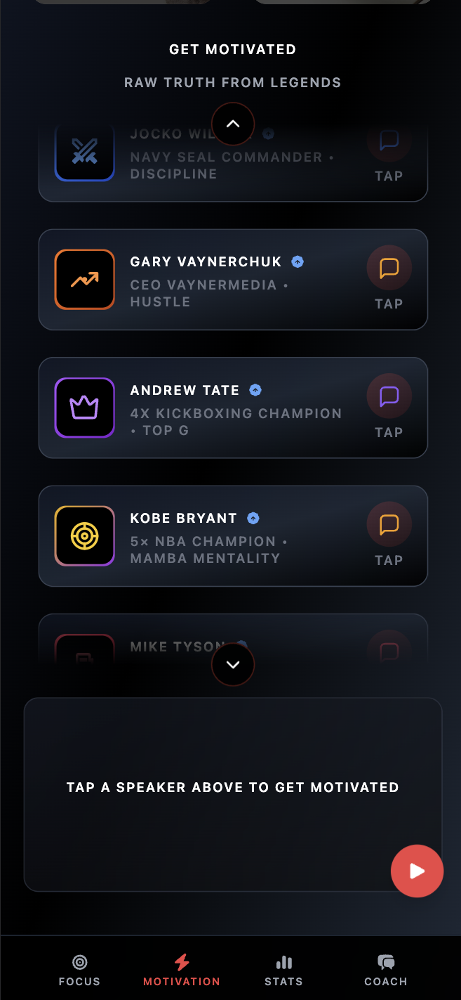
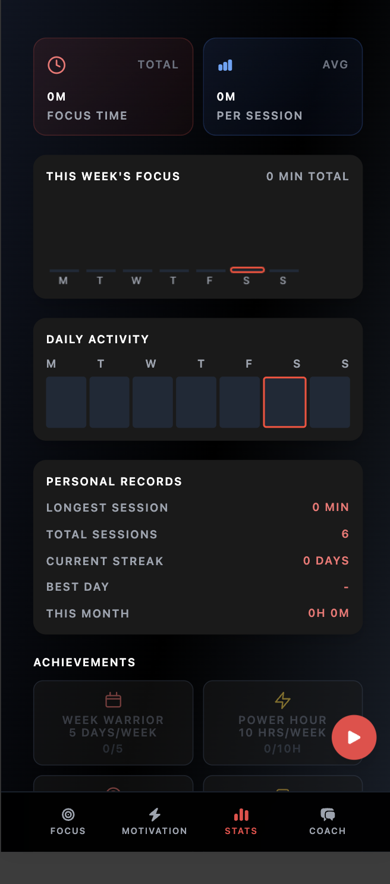
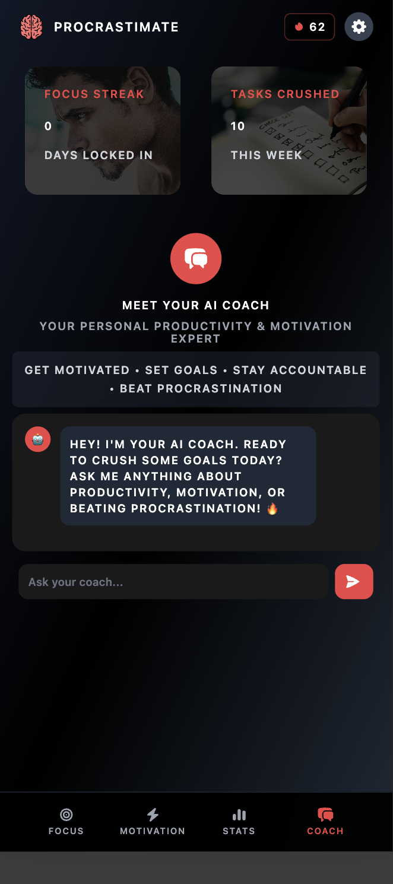
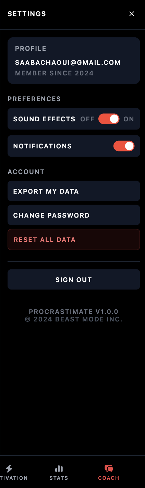

# Procrastimate 🧠🔥

> "You're not going to find your purpose in life. You're going to create it." - Davud Goggins 

  
&nbsp;&nbsp;&nbsp;
  

## The problem:
Every productivity app out there is either:
- Too soft ("Take a break! You're doing great! 😊")
- Too complicated (Looking at you Notion 👀)
- Too expensive (20$ a month? really?)

## My solution:
ProcrastiMate is different. It's aggressive motivation meets simple functionality. No BS, just:

### 🎯 Focus Timer:
Pick your time (25/45/60/custom), lock in, and work. The timer literally won't let you quit early without calling you out.

### 💀 Tough Love Motivation:
140+ quotes from 20 absolute savages:
- David Goggins (Navy SEAL, ultra runner)
- Jocko Willink (Navy SEAL commander)
- Kobe Bryant (RIP Mamba)
- Mike Tyson, Andrew Tate, and 15 more

Click any speaker and get hit with reality. The quotes actually slap different at 2am when you're grinding.

### 📊 Stats That Matter:
- Daily streaks (miss a day = back to zero, no mercy)
- Focus time tracking
- Weekly progress bars that shame you if empty
- Achievement system (actually hard to unlock)

### 🤖 AI Coach (Experimental):
Chat with an AI that doesn't coddle you. Ask it why you're procrastinating and it'll tell you straight up. Powered by Hugging Face's 
API.

## Tech Stack

  
| | | | | | |
|:---:|:---:|:---:|:---:|:---:|:---:|
|  |  |  |  |  |  |
| JavaScript | HTML5 | CSS3 | Tailwind | Firebase | Android |

Nothing fancy, just what works:
- **Frontend:** Vanilla JS (no framework bloat)
- **Styling:** Tailwind CSS + custom animations  
- **Backend:** Firebase (auth + firestore)
- **Mobile:** Capacitor → Android
- **AI:** Hugging Face API
- **Voice:** ElevenLabs API

## Quick Start

### 🌐 Try it Online (Easiest)
  
  
### 📱 Get the App
  

### 💻 Run Locally

### Clone the repo
git clone https://github.com/Saad04040404/procrastimate.git

### Run locally
python3 -m http.server 8000
### Open http://localhost:8000

### Or just open index.html directly

## Android 📲
Coming soon on Google Play Store (in review)

## Screenshots 📸

<table>
  <tr>
    <td align="center">
      
       
      <b>Home Screen</b>
    </td>
    <td align="center">
      
       
      <b>Focus Timer</b>
    </td>
    <td align="center">
      
       
      <b>Motivation Quotes</b>
    </td>
  </tr>
  <tr>
    <td align="center">
      
       
      <b>Progress Stats</b>
    </td>
    <td align="center">
      
       
      <b>AI Coach</b>
    </td>
    <td align="center">
      
       
      <b>Settings</b>
    </td>
  </tr>
</table>

## Features Breakdown 🛠️

What's Working:
✅ All timers and tracking
✅ Quote system with voice
✅ Firebase sync
✅ PWA (installable)
✅ Offline mode
✅ Android build

What I'm Still Fixing:
🔧 iOS version (Capacitor being weird)
🔧 Some quotes cut off on small screens
🔧 AI coach rate limiting issues

## Story behind this:

Started building this in June 2025 after realizing I was spending more time scrolling than coding. Two months later, I somehow turned 
procrastination itself into an app about fighting procrastination.
The coding part was fun. The real struggle was digging through podcasts, interviews and tiktoks to find quotes that actually slap. 
Now, the app roasts me harder than my friends do when I skip the gym.

## Want to Contribute?

If you've got:
- More savage quotes from these speakers
- Bug fixes
- Feature ideas that keep it simple
Hit me up or make a PR. Just don't suggest adding meditation features or anything soft.

## Numbers:

140+ curated quotes (7-8 per speaker)
20 speakers from different disciplines
2000+ lines of JavaScript
0 frameworks
0 patience for procrastination

## License
MIT - Take it, modify it, whatever. Just actually use it to get work done.

## Contact
Built by yours truly Saad Bachaoui
- Struggling with procrastination since: Forever
- Finally doing something about it: 2025
- https://www.linkedin.com/in/saad-bachaoui-b1323633b/
- saabachaoui@gamil.com

**Final note:** If this app helps you finally start that project you've been putting off, let me know. If it doesn't, also let me know 
so I can make it more aggressive.
"Nobody cares. Work harder." - Cam Hanes
