<div align="center">

# 🔥 **PROCRASTIMATE** 🔥
### *"Destroy procrastination before it destroys you"*


---

### 🎯 **LIVE DEMO** | 📱 **GET THE APP**

<a href="https://procrastimate-chi.vercel.app/">
  
</a>
&nbsp;&nbsp;
<a href="https://play.google.com/store/apps/details?id=com.procrastimate.app">
  
</a>

</div>

---

## 🚫 **THE PROBLEM WITH EVERY OTHER APP**

<table>
<tr>
<td width="33%" align="center">

<br><sub><i>"Take a break! You deserve it! 🌸"</i></sub>
</td>
<td width="33%" align="center">

<br><sub><i>47 buttons to start a timer</i></sub>
</td>
<td width="33%" align="center">

<br><sub><i>$20/month for basic features</i></sub>
</td>
</tr>
</table>

---

## ⚡ **MY SOLUTION: AGGRESSIVE SIMPLICITY**

<div align="center">

```ascii
┌─────────────────────────────────────────────────────────────┐
│  🎯 TIMER → 💀 MOTIVATION → 📊 STATS → 🏆 ACHIEVEMENTS      │
│                                                             │
│             NO FLUFF. NO EXCUSES. JUST RESULTS.            │
└─────────────────────────────────────────────────────────────┘
```

</div>

### 🎯 **FOCUS TIMER THAT DOESN'T LIE**
```
Pick your poison: 25min | 45min | 60min | Custom
Hit START → The app LOCKS you in
Try to quit early? Get called out publicly.
```

### 💀 **140+ QUOTES FROM ABSOLUTE SAVAGES**
<div align="center">

| 🥊 | 🏀 | ⚔️ | 🏃‍♂️ | 💼 |
|:---:|:---:|:---:|:---:|:---:|
| **MIKE TYSON** | **KOBE BRYANT** | **JOCKO WILLINK** | **DAVID GOGGINS** | **ANDREW TATE** |
| *"Discipline is doing what you hate to do, but nonetheless doing it like you love it"* | *"The most important thing is to try and inspire people so that they can be great at whatever they want to do"* | *"Discipline equals freedom"* | *"You're not going to find your purpose. You're going to create it"* | *"The temporary satisfaction of quitting is never worth the eternal regret of giving up"* |

</div>

**+ 15 MORE LEGENDS WHO DON'T ACCEPT MEDIOCRITY**

### 📊 **STATS THAT SHAME YOU INTO ACTION**
```bash
Daily Streak: 🔥 7 days (miss one = back to ZERO)
Focus Time: ⏱️ 156 hours this month
Weekly Goal: ▓▓▓▓▓░░ 73% (not enough)
Achievements: 🏆 12/50 unlocked (work harder)
```

### 🤖 **AI COACH (EXPERIMENTAL - NO CODDLING)**
> **You:** "Why do I keep procrastinating?"  
> **AI:** "Because you're choosing comfort over growth. Stop asking why and start doing."

---

## 🛠️ **TECH STACK (NO BLOAT)**

```mermaid
graph LR
    A[🌐 Vanilla JS] --> B[🎨 Tailwind CSS]
    B --> C[🔥 Firebase]
    C --> D[📱 Capacitor]
    D --> E[🤖 Hugging Face]
    E --> F[🎙️ ElevenLabs]
    
    style A fill:#f9d71c
    style B fill:#38bdf8
    style C fill:#ff8a65
    style D fill:#5c6bc0
    style E fill:#ff5722
    style F fill:#9c27b0
```

<div align="center">



</div>

<div align="center">

| **Frontend** | **Styling** | **Backend** | **Mobile** | **AI** | **Voice** |
|:---:|:---:|:---:|:---:|:---:|:---:|
|  |  |  |  |  |  |

</div>

**Why these choices?**
- ⚡ **No framework bloat** - Loads in 0.8 seconds
- 🔒 **Firebase** - Your data syncs everywhere
- 📱 **Capacitor** - One codebase, all platforms
- 🎯 **Focused** - Each tool has ONE job

---

## 🚀 **GET STARTED (CHOOSE YOUR PAIN)**

### 🌐 **Option 1: Instant Gratification**
Click → Use → Done.

<a href="https://procrastimate-chi.vercel.app/">
  
</a>

### 📱 **Option 2: Mobile Warrior**
Download → Install → Dominate.

<a href="https://play.google.com/store/apps/details?id=com.procrastimate.app">
  
</a>

### 💻 **Option 3: Developer Mode**
```bash
# Clone the beast
git clone https://github.com/Saad04040404/procrastimate.git

# Enter the arena
cd procrastimate-app

# Choose your weapon:
python3 -m http.server 8000
# OR
npx serve .
# OR
just open index.html

# Navigate to: http://localhost:8000
```

---

## 📸 **VISUAL PROOF IT WORKS**

<div align="center">

<table>
<tr>
<td align="center" width="33%">

<br><b>🏠 Command Center</b><br>
<sub>Your battlefield overview</sub>
</td>
<td align="center" width="33%">

<br><b>⏰ Focus Chamber</b><br>
<sub>Where distractions go to die</sub>
</td>
<td align="center" width="33%">

<br><b>💥 Motivation Arsenal</b><br>
<sub>140+ reality checks</sub>
</td>
</tr>
<tr>
<td align="center" width="33%">

<br><b>📊 Progress Tracker</b><br>
<sub>Numbers don't lie</sub>
</td>
<td align="center" width="33%">

<br><b>🤖 AI Drill Sergeant</b><br>
<sub>No sympathy mode</sub>
</td>
<td align="center" width="33%">

<br><b>⚙️ Control Panel</b><br>
<sub>Customize your torture</sub>
</td>
</tr>
</table>

</div>

---

## ⚡ **FEATURES STATUS**

<div align="center">

```diff
✅ WORKING PERFECTLY:
+ Focus timers (all durations)
+ Quote system with voice synthesis
+ Real-time Firebase sync
+ PWA installation
+ Offline functionality
+ Android app (Google Play under review)
+ Achievement system
+ Dark mode (obviously)

🔧 WORK IN PROGRESS:
- iOS version (Capacitor being difficult)
- Quote responsiveness on tiny screens
- AI coach rate limiting optimization
- More savage speakers (suggestions welcome)
```

</div>

---

## 📈 **THE NUMBERS THAT MATTER**

<div align="center">

| 📊 **METRIC** | 🔢 **VALUE** | 💭 **MEANING** |
|:---:|:---:|:---:|
| **Quotes Curated** | `140+` | Hand-picked for maximum impact |
| **Legendary Speakers** | `20` | Only the absolute best |
| **Lines of Code** | `2000+` | No bloat, pure functionality |
| **Frameworks Used** | `0` | Vanilla JS supremacy |
| **Excuses Accepted** | `0` | Non-negotiable |
| **Build Time** | `< 1 sec` | Because waiting is procrastinating |

</div>

---

## 🎯 **THE ORIGIN STORY**

<div align="center">

```ascii
┌─────────────────────────────────────────────────────────────┐
│  JUNE 2025: "I should stop scrolling and start coding"     │
│  JULY 2025: "Maybe I'll build an anti-procrastination app" │
│  AUG 2025: "Wait... I procrastinated building an app       │
│             about procrastination. The irony is real."     │
│  SEPT 2025: "Fine. Time to get serious."                   │
│  TODAY: This beast exists.                                 │
└─────────────────────────────────────────────────────────────┘
```

</div>

**The real challenge?** Finding quotes that actually hit different at 2 AM when you're grinding. Spent weeks digging through podcasts, interviews, and TikToks to curate 140+ quotes that don't just motivate – they **transform**.

---

## 🤝 **WANT TO CONTRIBUTE?**

<div align="center">

### **We need:**
```bash
🎯 More savage quotes from existing speakers
🐛 Bug fixes (especially mobile responsive issues)
💡 Simple feature ideas (keyword: SIMPLE)
📱 iOS testing help
🎨 UI/UX improvements that maintain the aggressive aesthetic
```

### **We DON'T need:**
```bash
❌ Meditation features
❌ "Take a break" suggestions  
❌ Cute animations
❌ Framework migrations
❌ Anything that makes this app "softer"
```

</div>

**Ready to contribute?** 
1. Fork it
2. Make it better
3. PR it
4. Get recognized

---

## 📄 **LICENSE & CONTACT**

<div align="center">

### **License:** MIT
*Take it. Modify it. Just actually USE it to get stuff done.*

---

### **Built by Saad Bachaoui**

<a href="https://www.linkedin.com/in/saad-bachaoui-b1323633b/">
  
</a>
<a href="mailto:sbach081@uottawa.ca">
  
</a>

**Timeline:**
- 🎯 **Struggling with procrastination since:** Forever
- 💡 **Finally doing something about it:** 2025
- 🚀 **Current status:** Shipping solutions

</div>

---

<div align="center">

### 🔥 **FINAL CHALLENGE** 🔥


---

> **"Nobody cares. Work harder."** - Cam Hanes

**⭐ Star this repo if it helped you stop being a procrastinator**

</div>

---

<div align="center">

[](https://github.com/Saad647504/procrastimate)

</div>
